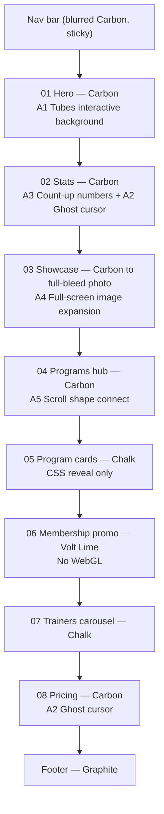

# Gyms — UI & Motion Specification
> Carbon black with a volt-lime pulse — now in motion.

This document merges the **visual system** (`style.md`, `style_extend.md`) with the **animation references** (`a_background.md`, `a_cursor.md`, `a_datadisplay.md`, `a_fullscreenimage.md`, `a_scroll.md`) into one implementation-ready UI spec for the `gyms` theme.

The animation references were written as React components. Because this is a Botble/Laravel theme (Blade views + static assets), every effect below is re-specified as **framework-free vanilla JS (ES modules)** with brand-adapted colors, but keeps the original props/behaviour so a React port stays 1:1.

---

## 1. Design Foundations (summary)

Full tokens live in [`style_extend.md`](./style_extend.md). The values that matter most for motion:

| Token | Value | Used by |
|-------|-------|---------|
| `--color-carbon-black` | `#0A0A0B` | Canvas behind every WebGL effect |
| `--color-graphite` | `#141417` | Shape fills (scroll hub), dark cards |
| `--color-steel` | `#24242A` | Idle connector lines, borders |
| `--color-chalk` | `#F2F2EC` | Light sections (no WebGL here) |
| `--color-volt-lime` | `#C6FF00` | Tubes, ghost cursor, stat numbers, active shapes |
| `--color-ember-orange` | `#FF5A1F` | Tube lights, gradient endpoint, heat accents |
| `--color-volt-wash` | `#EEFFB8` | Highlight tints |
| `--gradient-energy` | `linear-gradient(270deg, #C6FF00 35%, #FF5A1F)` | Connector strokes, stat underlines |
| `--font-display` | Bebas Neue (uppercase, 400) | Headlines, stat numbers, shape labels |
| `--font-body` | Inter 400–700 | Body, UI, eyebrows |

```html
<link rel="preconnect" href="https://fonts.googleapis.com">
<link rel="preconnect" href="https://fonts.gstatic.com" crossorigin>
<link href="https://fonts.googleapis.com/css2?family=Bebas+Neue&family=Inter:wght@400;500;600;700&display=swap" rel="stylesheet">
```

### Motion Tokens

```css
:root {
  /* Easing */
  --ease-out-expo: cubic-bezier(0.16, 1, 0.3, 1);     /* reveals, count-up feel */
  --ease-in-out-cubic: cubic-bezier(0.65, 0, 0.35, 1); /* scroll-driven morphs */
  --ease-snap: cubic-bezier(0.34, 1.56, 0.64, 1);     /* button pops, badges */

  /* Durations */
  --dur-fast: 160ms;   /* hover color/border */
  --dur-base: 320ms;   /* button lift, card hover */
  --dur-slow: 700ms;   /* section reveal */
  --dur-count: 2000ms; /* stat count-up */

  /* Reveal */
  --reveal-distance: 32px;
}

@media (prefers-reduced-motion: reduce) {
  :root { --dur-fast: 0ms; --dur-base: 0ms; --dur-slow: 0ms; --dur-count: 0ms; }
}
```

**Motion principles**
1. **One loud effect per viewport.** WebGL (tubes or ghost cursor) never runs on the same screen as another WebGL effect.
2. **Volt = energy.** Every animated highlight resolves to Volt Lime; Ember only appears as a secondary light/heat tint.
3. **Scroll drives the story, not time.** Expansion and hub animations are scrubbed by scroll progress, never autoplayed.
4. **Dark surfaces only for glow.** Bloom/screen-blend effects are only mounted on Carbon/Graphite sections — they disappear on Chalk and fight Volt.

---

## 2. Page Map — Where Each Animation Lives



| # | Section | Background | Animation | Source ref |
|---|---------|------------|-----------|------------|
| 01 | Hero | Carbon `#0A0A0B` | **A1 Tubes background** (replaces the static gradient ribbon as the hero signature) | `a_background.md` |
| 02 | Stats | Carbon | **A3 Count-up** + **A2 Ghost cursor** | `a_datadisplay.md`, `a_cursor.md` |
| 03 | Showcase | Carbon → photo | **A4 Full-screen image expansion** | `a_fullscreenimage.md` |
| 04 | Programs hub | Carbon | **A5 Scroll shape connect** | `a_scroll.md` |
| 05–07 | Programs / Promo / Trainers | Chalk / Volt / Chalk | CSS reveal (fade-up) only | — |
| 08 | Pricing | Carbon | **A2 Ghost cursor** | `a_cursor.md` |

> Ghost cursor is **not** mounted in the hero: the tubes already follow the pointer, and two cursor effects would compete.

---

## 3. A1 — Hero: Tubes Interactive Background

**Source:** `a_background.md` (TubesBackground, `threejs-components` tubes1 cursor by Kevin Levron).
**Role in system:** Kinetic replacement for the old static gradient ribbon. Neon tubes chase the cursor in 3D behind the stacked Bebas headline.

### Brand adaptation
| Original | Gyms version |
|----------|--------------|
| Tubes `#f967fb, #53bc28, #6958d5` | `#C6FF00, #FF5A1F, #FFFFFF` |
| Lights `#83f36e, #fe8a2e, #ff008a, #60aed5` | `#C6FF00, #FF5A1F, #EEFFB8, #FF8A3D` |
| Click → fully random hex colors | Click → cycle through **3 brand palettes** (never off-brand) |
| Light intensity 200 | 160 (keeps headline contrast ≥ 7:1) |
| Container `bg-background` | `#0A0A0B` + bottom fade into next section |

### Markup (Blade partial)
```html
<section class="hero" data-tubes>
  <canvas class="hero__canvas" aria-hidden="true"></canvas>
  <div class="hero__veil" aria-hidden="true"></div>

  <div class="hero__content container">
    <p class="eyebrow">Open 24/7 · Downtown</p>
    <h1 class="hero__title">Train <span class="text-volt">harder</span><br>live stronger</h1>
    <p class="hero__lead">Coaching, programs and a community that pushes you further.</p>
    <div class="hero__actions">
      <a href="#pricing" class="btn btn--primary">Join now</a>
      <a href="#trial" class="btn btn--ghost">Free trial</a>
    </div>
  </div>

  <div class="hero__hint" aria-hidden="true">Click to charge up</div>
</section>
```

### CSS
```css
.hero { position: relative; min-height: 100svh; overflow: hidden; background: var(--color-carbon-black); isolation: isolate; }
.hero__canvas { position: absolute; inset: 0; width: 100%; height: 100%; display: block; touch-action: none; opacity: 0; transition: opacity 1.2s var(--ease-out-expo); }
.hero.is-ready .hero__canvas { opacity: 1; }

/* Keeps text readable over bright tubes + fades into next section */
.hero__veil { position: absolute; inset: 0; pointer-events: none;
  background:
    linear-gradient(90deg, rgba(10,10,11,.85) 0%, rgba(10,10,11,.35) 55%, transparent 100%),
    linear-gradient(180deg, transparent 70%, var(--color-carbon-black) 100%); }

.hero__content { position: relative; z-index: 2; padding-block: 160px 120px; pointer-events: none; }
.hero__content a, .hero__content button { pointer-events: auto; }

.hero__title { font-family: var(--font-display); font-size: clamp(64px, 11vw, var(--text-display));
  line-height: var(--leading-display); letter-spacing: var(--tracking-display); text-transform: uppercase; color: #fff; }
.text-volt { color: var(--color-volt-lime); }

.hero__hint { position: absolute; bottom: 32px; left: 50%; transform: translateX(-50%); z-index: 2;
  font: 600 12px/1 var(--font-body); letter-spacing: var(--tracking-eyebrow); text-transform: uppercase;
  color: rgba(255,255,255,.5); animation: pulse 2s ease-in-out infinite; }
@keyframes pulse { 50% { opacity: .35; } }
```

### JS — `assets/js/effects/tubes-hero.js`
```js
const PALETTES = [
  { tubes: ['#C6FF00', '#FF5A1F', '#FFFFFF'], lights: ['#C6FF00', '#FF5A1F', '#EEFFB8', '#FF8A3D'] }, // Volt / Ember
  { tubes: ['#C6FF00', '#9BE000', '#EEFFB8'], lights: ['#C6FF00', '#EEFFB8', '#7FD400', '#FFFFFF'] }, // Full volt
  { tubes: ['#FF5A1F', '#FF8A3D', '#C6FF00'], lights: ['#FF5A1F', '#FFB03D', '#C6FF00', '#FF3D00'] }, // Heat
];

export async function initTubesHero(section, { enableClickInteraction = true } = {}) {
  const canvas = section.querySelector('.hero__canvas');
  if (!canvas || matchMedia('(prefers-reduced-motion: reduce)').matches) return;

  try {
    const { default: TubesCursor } = await import(
      'https://cdn.jsdelivr.net/npm/threejs-components@0.0.19/build/cursors/tubes1.min.js'
    );
    const app = TubesCursor(canvas, {
      tubes: { colors: PALETTES[0].tubes, lights: { intensity: 160, colors: PALETTES[0].lights } },
    });
    section.classList.add('is-ready');

    let i = 0;
    if (enableClickInteraction) {
      section.addEventListener('click', (e) => {
        if (e.target.closest('a, button')) return; // don't hijack CTAs
        i = (i + 1) % PALETTES.length;
        app.tubes.setColors(PALETTES[i].tubes);
        app.tubes.setLightsColors(PALETTES[i].lights);
      });
    }
    return app;
  } catch (err) {
    console.error('Tubes hero failed to load:', err); // fallback: static Carbon + Energy gradient stays visible
  }
}
```

**Fallback (no WebGL / reduced motion):** `.hero` gets `background: radial-gradient(60% 80% at 80% 30%, rgba(198,255,0,.18), transparent 60%), radial-gradient(40% 60% at 95% 80%, rgba(255,90,31,.15), transparent 60%), #0A0A0B;`

---

## 4. A2 — Ghost Cursor (Dark Content Sections)

**Source:** `a_cursor.md` (GhostCursor — Three.js FBM smoke shader + UnrealBloom + film grain).
**Role in system:** Subtle volt smoke that trails the pointer on dark *content* sections (Stats, Pricing), adding atmosphere without stealing focus.

### Brand-adapted props
| Prop | Original demo | Gyms value | Why |
|------|---------------|------------|-----|
| `color` | `#B19EEF` | `#C6FF00` | Volt Lime is the energy color |
| `brightness` | 1.2 | 0.9 | Lime is far brighter than lilac — avoid blowing out text |
| `trailLength` | 20 | 24 | Slightly longer "sweat trail" |
| `inertia` | 0.4 | 0.45 | Same fluid lag |
| `grainIntensity` | 0.05 | 0.04 | Gritty but clean |
| `bloomStrength` | 0.5 | 0.35 | Keep glow inside the brand's `--shadow-glow-volt` feel |
| `bloomRadius` | 0.7 | 0.7 | — |
| `bloomThreshold` | 0 | 0 | — |
| `mixBlendMode` | `screen` | `screen` | Only valid on dark backgrounds |
| `fadeDelayMs` / `fadeDurationMs` | 200 / 1000 | 250 / 1000 | Quick, responsive fade |
| `zIndex` | 10 | 1 | Sits under content (`z-index: 2`) |

**Rules**
- Mount only on sections with `data-ghost-cursor` **and** a Carbon/Graphite background.
- Disable on touch devices (`pointer: coarse`) and with `prefers-reduced-motion`.
- Initialise lazily with `IntersectionObserver`; dispose when the section leaves the viewport for > 5 s.

### Markup
```html
<section class="section section--dark" data-ghost-cursor>
  <!-- content: z-index 2 -->
</section>
```
```css
.section--dark { position: relative; background: var(--color-carbon-black); color: #fff; overflow: hidden; }
.section--dark > *:not(.ghost-cursor) { position: relative; z-index: 2; }
.ghost-cursor { position: absolute; inset: 0; pointer-events: none; z-index: 1; }
```

### JS — `assets/js/effects/ghost-cursor.js` (vanilla port of `GhostCursor`)
Requires an import map for Three.js:
```html
<script type="importmap">
{ "imports": {
  "three": "https://cdn.jsdelivr.net/npm/three@0.160.0/build/three.module.js",
  "three/addons/": "https://cdn.jsdelivr.net/npm/three@0.160.0/examples/jsm/"
} }
</script>
```

```js
import * as THREE from 'three';
import { EffectComposer } from 'three/addons/postprocessing/EffectComposer.js';
import { RenderPass } from 'three/addons/postprocessing/RenderPass.js';
import { UnrealBloomPass } from 'three/addons/postprocessing/UnrealBloomPass.js';
import { ShaderPass } from 'three/addons/postprocessing/ShaderPass.js';

const DEFAULTS = {
  color: '#C6FF00', brightness: 0.9, trailLength: 24, inertia: 0.45,
  grainIntensity: 0.04, bloomStrength: 0.35, bloomRadius: 0.7, bloomThreshold: 0,
  edgeIntensity: 0, mixBlendMode: 'screen', maxDevicePixelRatio: 0.5,
  fadeDelayMs: 250, fadeDurationMs: 1000, targetPixels: 1.3e6,
};

const VERT = /* glsl */`varying vec2 vUv; void main(){ vUv = uv; gl_Position = vec4(position, 1.0); }`;

// Fragment shader — identical to a_cursor.md (FBM smoke blobs along the trail)
const FRAG = /* glsl */`
uniform float iTime; uniform vec3 iResolution; uniform vec2 iMouse;
uniform vec2 iPrevMouse[MAX_TRAIL_LENGTH]; uniform float iOpacity; uniform float iScale;
uniform vec3 iBaseColor; uniform float iBrightness; uniform float iEdgeIntensity;
varying vec2 vUv;
float hash(vec2 p){ return fract(sin(dot(p,vec2(127.1,311.7)))*43758.5453123); }
float noise(vec2 p){ vec2 i=floor(p), f=fract(p); f=f*f*(3.-2.*f);
  return mix(mix(hash(i),hash(i+vec2(1.,0.)),f.x), mix(hash(i+vec2(0.,1.)),hash(i+vec2(1.,1.)),f.x), f.y); }
float fbm(vec2 p){ float v=0., a=.5; mat2 m=mat2(cos(.5),sin(.5),-sin(.5),cos(.5));
  for(int i=0;i<5;i++){ v+=a*noise(p); p=m*p*2.; a*=.5; } return v; }
vec3 tint1(vec3 b){ return mix(b, vec3(1.0), 0.15); }
vec3 tint2(vec3 b){ return mix(b, vec3(1.0, 0.55, 0.2), 0.18); } /* warm Ember tint instead of the original cool blue */
vec4 blob(vec2 p, vec2 m, float intensity, float activity){
  vec2 q=vec2(fbm(p*iScale+iTime*.1), fbm(p*iScale+vec2(5.2,1.3)+iTime*.1));
  vec2 r=vec2(fbm(p*iScale+q*1.5+iTime*.15), fbm(p*iScale+q*1.5+vec2(8.3,2.8)+iTime*.15));
  float smoke=fbm(p*iScale+r*.8);
  float radius=.5+.3*(1./iScale);
  float d=1.-smoothstep(0., radius*activity, length(p-m));
  float a=pow(smoke,2.5)*d;
  vec3 c=mix(tint1(iBaseColor), tint2(iBaseColor), sin(iTime*.5)*.5+.5);
  return vec4(c*a*intensity, a*intensity);
}
void main(){
  vec2 asp=vec2(iResolution.x/iResolution.y,1.);
  vec2 uv=(gl_FragCoord.xy/iResolution.xy*2.-1.)*asp;
  vec2 mouse=(iMouse*2.-1.)*asp;
  vec4 b=blob(uv,mouse,1.,iOpacity); vec3 col=b.rgb; float al=b.a;
  for(int i=0;i<MAX_TRAIL_LENGTH;i++){
    vec2 pm=(iPrevMouse[i]*2.-1.)*asp;
    float t=pow(1.-float(i)/float(MAX_TRAIL_LENGTH),2.);
    if(t>.01){ vec4 bt=blob(uv,pm,t*.8,iOpacity); col+=bt.rgb; al+=bt.a; }
  }
  col*=iBrightness;
  vec2 u=gl_FragCoord.xy/iResolution.xy;
  float e=clamp(min(min(u.x,1.-u.x),min(u.y,1.-u.y))*2.,0.,1.);
  float mask=mix(1.-clamp(iEdgeIntensity,0.,1.),1.,e);
  gl_FragColor=vec4(col, clamp(al*iOpacity*mask,0.,1.));
}`;

const PASS_VERT = /* glsl */`varying vec2 vUv; void main(){ vUv=uv; gl_Position=projectionMatrix*modelViewMatrix*vec4(position,1.); }`;

export class GhostCursor {
  constructor(parent, opts = {}) {
    this.o = { ...DEFAULTS, ...opts };
    this.parent = parent;
    this.host = Object.assign(document.createElement('div'), { className: 'ghost-cursor' });
    parent.prepend(this.host);

    const o = this.o;
    const r = (this.renderer = new THREE.WebGLRenderer({ antialias: true, alpha: true, depth: false, stencil: false, premultipliedAlpha: false }));
    r.setClearColor(0x000000, 0);
    Object.assign(r.domElement.style, { display: 'block', width: '100%', height: '100%', pointerEvents: 'none', mixBlendMode: o.mixBlendMode });
    this.host.appendChild(r.domElement);

    const N = Math.max(1, Math.floor(o.trailLength));
    this.trail = Array.from({ length: N }, () => new THREE.Vector2(0.5, 0.5));
    this.head = 0;
    const c = new THREE.Color(o.color);

    this.mat = new THREE.ShaderMaterial({
      defines: { MAX_TRAIL_LENGTH: N },
      uniforms: {
        iTime: { value: 0 }, iResolution: { value: new THREE.Vector3(1, 1, 1) },
        iMouse: { value: new THREE.Vector2(0.5, 0.5) }, iPrevMouse: { value: this.trail.map((v) => v.clone()) },
        iOpacity: { value: 1 }, iScale: { value: 1 }, iBaseColor: { value: new THREE.Vector3(c.r, c.g, c.b) },
        iBrightness: { value: o.brightness }, iEdgeIntensity: { value: o.edgeIntensity },
      },
      vertexShader: VERT, fragmentShader: FRAG, transparent: true, depthTest: false, depthWrite: false,
    });

    const scene = new THREE.Scene();
    this.geom = new THREE.PlaneGeometry(2, 2);
    scene.add(new THREE.Mesh(this.geom, this.mat));

    this.composer = new EffectComposer(r);
    this.composer.addPass(new RenderPass(scene, new THREE.OrthographicCamera(-1, 1, 1, -1, 0, 1)));
    this.bloom = new UnrealBloomPass(new THREE.Vector2(1, 1), o.bloomStrength, o.bloomRadius, o.bloomThreshold);
    this.composer.addPass(this.bloom);
    this.film = new ShaderPass({
      uniforms: { tDiffuse: { value: null }, iTime: { value: 0 }, intensity: { value: o.grainIntensity } },
      vertexShader: PASS_VERT,
      fragmentShader: `uniform sampler2D tDiffuse; uniform float iTime; uniform float intensity; varying vec2 vUv;
        float h(float n){ return fract(sin(n)*43758.5453); }
        void main(){ vec4 c=texture2D(tDiffuse,vUv); float n=h(vUv.x*1000.+vUv.y*2000.+iTime)*2.-1.; c.rgb+=n*intensity*c.rgb; gl_FragColor=c; }`,
    });
    this.composer.addPass(this.film);
    this.composer.addPass(new ShaderPass({
      uniforms: { tDiffuse: { value: null } }, vertexShader: PASS_VERT,
      fragmentShader: `uniform sampler2D tDiffuse; varying vec2 vUv;
        void main(){ vec4 c=texture2D(tDiffuse,vUv); gl_FragColor=vec4(clamp(c.rgb/max(c.a,1e-5),0.,1.),c.a); }`,
    }));

    this.mouse = new THREE.Vector2(0.5, 0.5);
    this.vel = new THREE.Vector2();
    this.fade = 1; this.active = false; this.running = false;
    this.lastMove = performance.now(); this.start = performance.now();

    this.resize = this.resize.bind(this); this.tick = this.tick.bind(this);
    this.onMove = (e) => {
      const b = parent.getBoundingClientRect();
      this.mouse.set(THREE.MathUtils.clamp((e.clientX - b.left) / b.width, 0, 1), THREE.MathUtils.clamp(1 - (e.clientY - b.top) / b.height, 0, 1));
      this.active = true; this.lastMove = performance.now(); this.loop();
    };
    this.onEnter = () => { this.active = true; this.loop(); };
    this.onLeave = () => { this.active = false; this.lastMove = performance.now(); this.loop(); };

    parent.addEventListener('pointermove', this.onMove, { passive: true });
    parent.addEventListener('pointerenter', this.onEnter, { passive: true });
    parent.addEventListener('pointerleave', this.onLeave, { passive: true });
    this.ro = new ResizeObserver(this.resize); this.ro.observe(this.host);
    this.resize();
  }

  resize() {
    const b = this.host.getBoundingClientRect();
    const w = Math.max(1, Math.floor(b.width)), h = Math.max(1, Math.floor(b.height));
    const dpr = Math.min(devicePixelRatio || 1, this.o.maxDevicePixelRatio);
    const need = w * h * dpr * dpr;
    const pr = dpr * (need <= this.o.targetPixels ? 1 : Math.max(0.5, Math.sqrt(this.o.targetPixels / need)));
    this.renderer.setPixelRatio(pr); this.renderer.setSize(w, h, false);
    this.composer.setPixelRatio?.(pr); this.composer.setSize(w, h);
    this.mat.uniforms.iResolution.value.set(Math.floor(w * pr), Math.floor(h * pr), 1);
    this.mat.uniforms.iScale.value = Math.max(0.5, Math.min(2, Math.min(w, h) / 600));
    this.bloom.setSize(Math.floor(w * pr), Math.floor(h * pr));
  }

  loop() { if (!this.running) { this.running = true; this.raf = requestAnimationFrame(this.tick); } }

  tick(now) {
    const u = this.mat.uniforms;
    if (this.active) {
      this.vel.subVectors(this.mouse, u.iMouse.value); u.iMouse.value.copy(this.mouse); this.fade = 1;
    } else {
      this.vel.multiplyScalar(this.o.inertia);
      if (this.vel.lengthSq() > 1e-6) u.iMouse.value.add(this.vel);
      const dt = now - this.lastMove;
      if (dt > this.o.fadeDelayMs) this.fade = Math.max(0, 1 - (dt - this.o.fadeDelayMs) / this.o.fadeDurationMs);
    }
    const N = this.trail.length;
    this.head = (this.head + 1) % N; this.trail[this.head].copy(u.iMouse.value);
    for (let i = 0; i < N; i++) u.iPrevMouse.value[i].copy(this.trail[(this.head - i + N) % N]);

    const t = (now - this.start) / 1000;
    u.iOpacity.value = this.fade; u.iTime.value = t; this.film.uniforms.iTime.value = t;
    this.composer.render();

    if (!this.active && this.fade <= 0.001) { this.running = false; return; }
    this.raf = requestAnimationFrame(this.tick);
  }

  destroy() {
    cancelAnimationFrame(this.raf); this.running = false; this.ro.disconnect();
    this.parent.removeEventListener('pointermove', this.onMove);
    this.parent.removeEventListener('pointerenter', this.onEnter);
    this.parent.removeEventListener('pointerleave', this.onLeave);
    this.geom.dispose(); this.mat.dispose(); this.composer.dispose(); this.renderer.dispose();
    this.host.remove();
  }
}
```

---

## 5. A3 — Stats: Count-Up Numbers

**Source:** `a_datadisplay.md` — "Numbers displayed in large font with a count-up animation, triggered when scrolling into the viewport."
**Role in system:** The Stat Counter component in motion.

### Visual spec
- Number: Bebas Neue, `clamp(72px, 9vw, 128px)`, `#C6FF00`, line-height 0.85, `font-variant-numeric: tabular-nums` (prevents jitter while counting).
- Suffix (`+`, `K`, `%`): same font, 0.5em, `#FF5A1F` Ember.
- Label: Inter 600 12px uppercase, +0.14em, `#8A8A93`.
- Underline: 2px Energy Gradient that **draws left → right** in sync with the count (`scaleX 0 → 1`).
- Stagger: 150ms between columns. Duration: `--dur-count` (2000ms), easing: easeOutExpo.

### Markup
```html
<section class="section section--dark stats" data-ghost-cursor>
  <div class="container stats__grid">
    <div class="stat" data-countup>
      <div class="stat__value"><span class="stat__num" data-target="12500">0</span><span class="stat__suffix">+</span></div>
      <div class="stat__bar"></div>
      <p class="stat__label">Active members</p>
    </div>
    <div class="stat" data-countup>
      <div class="stat__value"><span class="stat__num" data-target="48">0</span></div>
      <div class="stat__bar"></div>
      <p class="stat__label">Certified trainers</p>
    </div>
    <div class="stat" data-countup>
      <div class="stat__value"><span class="stat__num" data-target="120">0</span><span class="stat__suffix">+</span></div>
      <div class="stat__bar"></div>
      <p class="stat__label">Weekly classes</p>
    </div>
    <div class="stat" data-countup>
      <div class="stat__value"><span class="stat__num" data-target="4.9" data-decimals="1">0</span></div>
      <div class="stat__bar"></div>
      <p class="stat__label">Member rating</p>
    </div>
  </div>
</section>
```

### CSS
```css
.stats { padding-block: var(--spacing-120); }
.stats__grid { display: grid; grid-template-columns: repeat(4, 1fr); gap: var(--spacing-32); }
@media (max-width: 768px) { .stats__grid { grid-template-columns: repeat(2, 1fr); row-gap: var(--spacing-56); } }

.stat__value { font-family: var(--font-display); font-size: clamp(72px, 9vw, var(--text-display)); line-height: .85;
  color: var(--color-volt-lime); font-variant-numeric: tabular-nums; }
.stat__suffix { font-size: .5em; color: var(--color-ember-orange); vertical-align: top; margin-left: 4px; }
.stat__bar { height: 2px; margin-block: 16px 12px; background: var(--gradient-energy);
  transform: scaleX(0); transform-origin: left; transition: transform var(--dur-count) var(--ease-out-expo); }
.stat.is-counted .stat__bar { transform: scaleX(1); }
.stat__label { font: 600 var(--text-eyebrow)/1.4 var(--font-body); letter-spacing: var(--tracking-eyebrow);
  text-transform: uppercase; color: var(--color-ash-grey); }
```

### JS — `assets/js/effects/countup.js`
```js
const easeOutExpo = (t) => (t === 1 ? 1 : 1 - Math.pow(2, -10 * t));

function countUp(el, duration) {
  const end = parseFloat(el.dataset.target);
  const decimals = parseInt(el.dataset.decimals || '0', 10);
  const fmt = new Intl.NumberFormat('en-US', { minimumFractionDigits: decimals, maximumFractionDigits: decimals });
  if (duration === 0) { el.textContent = fmt.format(end); return; }
  const start = performance.now();
  const step = (now) => {
    const t = Math.min(1, (now - start) / duration);
    el.textContent = fmt.format(end * easeOutExpo(t));
    if (t < 1) requestAnimationFrame(step);
  };
  requestAnimationFrame(step);
}

export function initCountUp(root = document) {
  const reduce = matchMedia('(prefers-reduced-motion: reduce)').matches;
  const io = new IntersectionObserver((entries) => {
    entries.forEach((entry) => {
      if (!entry.isIntersecting) return;
      const stats = [...entry.target.parentElement.querySelectorAll('[data-countup]')];
      const idx = stats.indexOf(entry.target);
      setTimeout(() => {
        entry.target.classList.add('is-counted');
        countUp(entry.target.querySelector('[data-target]'), reduce ? 0 : 2000);
      }, reduce ? 0 : idx * 150);
      io.unobserve(entry.target); // run once
    });
  }, { threshold: 0.4 });
  root.querySelectorAll('[data-countup]').forEach((el) => io.observe(el));
}
```

---

## 6. A4 — Showcase: Full-Screen Image Expansion

**Source:** `a_fullscreenimage.md` — "Start with a featured image centered in a small frame. As the user scrolls, the image expands smoothly until it fills the entire width and height of the browser."
**Role in system:** The cinematic photo moment between Stats and Programs — the brand's "Imagery" principle (dark, high-contrast athletic photo) delivered full-bleed.

### Behaviour (scroll-scrubbed)
| Progress `p` | Frame | Image | Overlay text |
|--------------|-------|-------|--------------|
| 0 | ~40vw × 50vh, centered, radius 28px | scale 1.2, `filter: grayscale(.4) brightness(.7)` | Side headlines "NO" (left) / "LIMITS" (right) in Bebas 128px, fully visible |
| 0 → 0.8 | Clip inset shrinks to 0, radius → 0 | scale → 1, filter → none | Side headlines slide outward + fade |
| 0.8 → 1 | Full viewport (hold) | — | Center caption fades in: eyebrow + Bebas 96px "Built in the dark" + Volt CTA |

Use `clip-path: inset()` on a full-viewport element (GPU-friendly, no layout reflow) rather than animating width/height.

### Markup
```html
<section class="expand" data-expand>
  <div class="expand__sticky">
    <h2 class="expand__side expand__side--left" aria-hidden="true">No</h2>
    <h2 class="expand__side expand__side--right" aria-hidden="true">Limits</h2>

    <figure class="expand__frame">
      url('images/showcase.jpg') }}" alt="Athlete lifting in the dark gym" loading="lazy">
    </figure>

    <div class="expand__caption">
      <p class="eyebrow">The floor</p>
      <h2 class="expand__title">Built in the dark</h2>
      <a href="#trial" class="btn btn--primary">Book a tour</a>
    </div>
  </div>
</section>
```

### CSS
```css
.expand { position: relative; height: 300vh; background: var(--color-carbon-black); --p: 0; --c: 0; }
.expand__sticky { position: sticky; top: 0; height: 100vh; overflow: hidden; display: grid; place-items: center; }

.expand__frame { position: absolute; inset: 0; margin: 0;
  clip-path: inset(calc(25vh * (1 - var(--p))) calc(30vw * (1 - var(--p))) round calc(28px * (1 - var(--p)))); }
.expand__frame img { width: 100%; height: 100%; object-fit: cover;
  transform: scale(calc(1.2 - .2 * var(--p)));
  filter: grayscale(calc(.4 * (1 - var(--p)))) brightness(calc(.7 + .3 * var(--p))); }
.expand__frame::after { content: ""; position: absolute; inset: 0;
  background: linear-gradient(180deg, transparent 40%, rgba(10,10,11,.85)); opacity: var(--c); }

.expand__side { position: absolute; top: 50%; z-index: 2; font-family: var(--font-display); text-transform: uppercase;
  font-size: clamp(64px, 10vw, var(--text-display)); line-height: .85; color: #fff; opacity: calc(1 - var(--p) * 1.4); }
.expand__side--left  { left: 4vw;  transform: translate(calc(-30vw * var(--p)), -50%); }
.expand__side--right { right: 4vw; transform: translate(calc(30vw * var(--p)), -50%); color: var(--color-volt-lime); }

.expand__caption { position: absolute; bottom: 12vh; left: 50%; z-index: 3; text-align: center;
  opacity: var(--c); transform: translate(-50%, calc(24px * (1 - var(--c)))); pointer-events: none; }
.expand__caption a { pointer-events: auto; }
.expand__title { font-family: var(--font-display); font-size: clamp(56px, 8vw, var(--text-heading-lg));
  line-height: .9; text-transform: uppercase; color: #fff; margin: 8px 0 28px; }

@media (prefers-reduced-motion: reduce) { .expand { height: auto; --p: 1; --c: 1; } .expand__sticky { position: relative; } }
```

### JS — `assets/js/effects/expand-image.js`
```js
const clamp = (v, a = 0, b = 1) => Math.min(b, Math.max(a, v));
const easeInOutCubic = (t) => (t < 0.5 ? 4 * t * t * t : 1 - Math.pow(-2 * t + 2, 3) / 2);

export function initExpandImage(section) {
  if (matchMedia('(prefers-reduced-motion: reduce)').matches) return;
  let ticking = false;
  const update = () => {
    const r = section.getBoundingClientRect();
    const raw = clamp(-r.top / (section.offsetHeight - innerHeight));
    section.style.setProperty('--p', easeInOutCubic(clamp(raw / 0.8)).toFixed(4));   // expansion phase
    section.style.setProperty('--c', clamp((raw - 0.8) / 0.2).toFixed(4));          // caption phase
    ticking = false;
  };
  addEventListener('scroll', () => { if (!ticking) { ticking = true; requestAnimationFrame(update); } }, { passive: true });
  addEventListener('resize', update);
  update();
}
```

---

## 7. A5 — Programs Hub: Scroll Shape Connect

**Source:** `a_scroll.md` — "As I scroll, one shape in the center becomes bigger and connects to all other smaller shapes."
**Role in system:** Visual metaphor for the gym's ecosystem — **one membership (center) powers every program (satellites)**. Leads into the Program cards section.

### Choreography (scroll-scrubbed, sticky 300vh)
| Phase | Progress | What happens |
|-------|----------|--------------|
| 1 — Idle | 0 → 0.15 | 6 small satellite shapes (Graphite fill, Steel 1px border) float gently (CSS idle bob). Center shape is a small 64px Volt circle. Heading "One membership" visible. |
| 2 — Charge | 0.15 → 0.45 | Center scales 1 → 2.6, Volt glow intensifies (`--shadow-glow-volt` × p), label "ALL ACCESS" fades in inside it. |
| 3 — Connect | 0.35 → 0.85 | 6 connector lines draw from center outward with **Energy Gradient** stroke, 80ms-equivalent stagger per line (`stroke-dashoffset 1 → 0`). |
| 4 — Light up | each line's end | Satellite it reaches: border → Volt, scale 1 → 1.15 (snap ease), label turns white, icon turns Volt. |
| 5 — Hold | 0.85 → 1 | All connected; a subtle pulse travels along lines (CSS `stroke-dashoffset` loop on a second dashed overlay). |

**Satellites (programs):** Strength · HIIT · Boxing · Yoga · Cardio · Nutrition
**Shape language:** circles for center, rounded squares (radius 28px — matches card radius) for satellites.

### Markup
```html
<section class="hub" data-hub>
  <div class="hub__sticky">
    <header class="hub__head container">
      <p class="eyebrow">Programs</p>
      <h2 class="hub__title">One membership.<br><span class="text-volt">Every discipline.</span></h2>
    </header>

    <div class="hub__stage">
      <svg class="hub__lines" viewBox="0 0 1000 600" preserveAspectRatio="xMidYMid meet" aria-hidden="true">
        <defs>
          <linearGradient id="energy" x1="0" x2="1"><stop offset="0" stop-color="#FF5A1F"/><stop offset=".65" stop-color="#C6FF00"/></linearGradient>
        </defs>
        <!-- one <line> per satellite; JS fills x2/y2 from satellite positions -->
      </svg>

      <div class="hub__core"><span>All<br>access</span></div>

      <div class="hub__sat" style="--x:14%; --y:22%">Strength</div>
      <div class="hub__sat" style="--x:86%; --y:22%">HIIT</div>
      <div class="hub__sat" style="--x:6%;  --y:62%">Boxing</div>
      <div class="hub__sat" style="--x:94%; --y:62%">Yoga</div>
      <div class="hub__sat" style="--x:30%; --y:92%">Cardio</div>
      <div class="hub__sat" style="--x:70%; --y:92%">Nutrition</div>
    </div>
  </div>
</section>
```

### CSS
```css
.hub { position: relative; height: 300vh; background: var(--color-carbon-black); color: #fff; --p: 0; }
.hub__sticky { position: sticky; top: 0; height: 100vh; display: grid; grid-template-rows: auto 1fr; overflow: hidden; padding-top: 96px; }
.hub__title { font-family: var(--font-display); font-size: clamp(48px, 7vw, var(--text-heading)); line-height: .92; text-transform: uppercase; }

.hub__stage { position: relative; width: min(1000px, 92vw); aspect-ratio: 5 / 3; margin: auto; }
.hub__lines { position: absolute; inset: 0; width: 100%; height: 100%; overflow: visible; }
.hub__lines line { stroke: url(#energy); stroke-width: 2; stroke-linecap: round; fill: none; }
.hub__lines line.is-base { stroke: var(--color-steel); stroke-dasharray: 4 8; }

.hub__core { position: absolute; left: 50%; top: 50%; width: 64px; aspect-ratio: 1; border-radius: 50%;
  background: var(--color-volt-lime); color: var(--color-carbon-black); display: grid; place-items: center; text-align: center;
  font: 400 14px/0.9 var(--font-display); text-transform: uppercase;
  transform: translate(-50%, -50%) scale(var(--core-scale, 1));
  box-shadow: 0 0 calc(64px * var(--core-glow, 0)) rgba(198, 255, 0, calc(.55 * var(--core-glow, 0))); z-index: 2; }
.hub__core span { opacity: var(--core-label, 0); }

.hub__sat { position: absolute; left: var(--x); top: var(--y); transform: translate(-50%, -50%) scale(var(--s, 1));
  padding: 14px 22px; border-radius: var(--radius-cards); background: var(--color-graphite); border: 1px solid var(--color-steel);
  font: 400 22px/1 var(--font-display); letter-spacing: .02em; text-transform: uppercase; color: var(--color-ash-grey);
  transition: border-color var(--dur-base), color var(--dur-base), transform var(--dur-base) var(--ease-snap), box-shadow var(--dur-base);
  animation: bob 4s ease-in-out infinite; animation-delay: calc(var(--i, 0) * -0.6s); z-index: 2; }
.hub__sat.is-on { border-color: var(--color-volt-lime); color: #fff; --s: 1.15; box-shadow: 0 0 24px rgba(198,255,0,.25); animation-play-state: paused; }
@keyframes bob { 50% { translate: 0 -6px; } }

@media (max-width: 768px) { .hub__sat { font-size: 16px; padding: 10px 14px; } }
@media (prefers-reduced-motion: reduce) {
  .hub { height: auto; } .hub__sticky { position: relative; height: auto; padding-block: 96px; }
  .hub__sat { animation: none; }
}
```

### JS — `assets/js/effects/scroll-hub.js`
```js
const clamp = (v, a = 0, b = 1) => Math.min(b, Math.max(a, v));
const range = (p, start, end) => clamp((p - start) / (end - start));
const easeOutExpo = (t) => (t === 1 ? 1 : 1 - Math.pow(2, -10 * t));
const SVG_NS = 'http://www.w3.org/2000/svg';

export function initScrollHub(section) {
  const svg = section.querySelector('.hub__lines');
  const core = section.querySelector('.hub__core');
  const sats = [...section.querySelectorAll('.hub__sat')];
  const reduce = matchMedia('(prefers-reduced-motion: reduce)').matches;

  // Build one dashed base line + one gradient line per satellite (viewBox 1000x600, center 500,300)
  const lines = sats.map((sat, i) => {
    sat.style.setProperty('--i', i);
    const x = parseFloat(sat.style.getPropertyValue('--x')) * 10;
    const y = parseFloat(sat.style.getPropertyValue('--y')) * 6;
    const mk = (cls) => {
      const l = document.createElementNS(SVG_NS, 'line');
      Object.entries({ x1: 500, y1: 300, x2: x, y2: y, pathLength: 1 }).forEach(([k, v]) => l.setAttribute(k, v));
      if (cls) l.classList.add(cls);
      svg.appendChild(l);
      return l;
    };
    mk('is-base');
    const live = mk();
    live.style.strokeDasharray = '1';
    live.style.strokeDashoffset = '1';
    return live;
  });

  const render = (p) => {
    // Phase 2 — charge
    const charge = easeOutExpo(range(p, 0.15, 0.45));
    core.style.setProperty('--core-scale', (1 + 1.6 * charge).toFixed(3));
    core.style.setProperty('--core-glow', charge.toFixed(3));
    core.style.setProperty('--core-label', range(p, 0.3, 0.45).toFixed(3));

    // Phase 3/4 — connect + light up (staggered)
    lines.forEach((line, i) => {
      const start = 0.35 + i * 0.07;
      const lp = easeOutExpo(range(p, start, start + 0.15));
      line.style.strokeDashoffset = (1 - lp).toFixed(4);
      sats[i].classList.toggle('is-on', lp > 0.98);
    });
  };

  if (reduce) { render(1); return; }

  let ticking = false;
  const onScroll = () => {
    if (ticking) return;
    ticking = true;
    requestAnimationFrame(() => {
      const r = section.getBoundingClientRect();
      render(clamp(-r.top / (section.offsetHeight - innerHeight)));
      ticking = false;
    });
  };
  addEventListener('scroll', onScroll, { passive: true });
  addEventListener('resize', onScroll);
  onScroll();
}
```

---

## 8. Shared UI Motion (non-WebGL)

### Section reveal (Chalk & Volt sections)
```css
[data-reveal] { opacity: 0; transform: translateY(var(--reveal-distance));
  transition: opacity var(--dur-slow) var(--ease-out-expo), transform var(--dur-slow) var(--ease-out-expo);
  transition-delay: calc(var(--i, 0) * 80ms); }
[data-reveal].is-visible { opacity: 1; transform: none; }
```
```js
export function initReveal() {
  const io = new IntersectionObserver((es) => es.forEach((e) => {
    if (e.isIntersecting) { e.target.classList.add('is-visible'); io.unobserve(e.target); }
  }), { threshold: 0.15, rootMargin: '0px 0px -10% 0px' });
  document.querySelectorAll('[data-reveal]').forEach((el) => io.observe(el));
}
```

### Buttons
```css
.btn { display: inline-flex; align-items: center; gap: 8px; padding: 16px 28px; border-radius: var(--radius-buttons);
  font: 700 16px/1 var(--font-body); letter-spacing: .04em; text-transform: uppercase; text-decoration: none;
  transition: transform var(--dur-base) var(--ease-snap), box-shadow var(--dur-base), background var(--dur-base), color var(--dur-fast), border-color var(--dur-fast); }
.btn--primary { background: var(--color-volt-lime); color: var(--color-carbon-black); }
.btn--primary:hover { background: var(--gradient-energy); transform: translateY(-2px); box-shadow: var(--shadow-glow-volt); }
.btn--ghost { color: #fff; border: 1.5px solid rgba(255,255,255,.4); font-weight: 600; }
.btn--ghost:hover { color: var(--color-volt-lime); border-color: var(--color-volt-lime); }
.btn:focus-visible { outline: 2px solid var(--color-volt-lime); outline-offset: 3px; }
```

### Cards
| Card | Hover |
|------|-------|
| Dark Feature Card (`#141417`) | border → `rgba(198,255,0,.5)`, translateY(-4px), 320ms |
| Trainer Card (`#FFFFFF` on Chalk) | photo scale 1.05 inside 20px-radius frame, name underline draws (Energy Gradient, scaleX 0→1) |
| Pricing Card (featured) | static Volt border + `--shadow-glow-volt` breathing (`opacity .6 ↔ 1`, 3s) |

### Nav
- Transparent over hero; after 80px scroll → `rgba(10,10,11,.8)` + `backdrop-filter: blur(12px)` + 1px `#24242A` bottom border (320ms).
- Active link: 2px Volt underline slides between items (`transform: translateX()`).

---

## 9. Bootstrapping — `assets/js/app.js`

```js
import { initTubesHero } from './effects/tubes-hero.js';
import { initCountUp } from './effects/countup.js';
import { initExpandImage } from './effects/expand-image.js';
import { initScrollHub } from './effects/scroll-hub.js';
import { initReveal } from './effects/reveal.js';

const reduceMotion = matchMedia('(prefers-reduced-motion: reduce)').matches;
const finePointer = matchMedia('(pointer: fine)').matches;

document.querySelectorAll('[data-tubes]').forEach((el) => initTubesHero(el));
document.querySelectorAll('[data-expand]').forEach(initExpandImage);
document.querySelectorAll('[data-hub]').forEach(initScrollHub);
initCountUp();
initReveal();

// Ghost cursor: lazy-load Three.js only on desktop, only when a dark section is on screen
if (finePointer && !reduceMotion) {
  const instances = new Map();
  const io = new IntersectionObserver(async (entries) => {
    for (const e of entries) {
      if (e.isIntersecting && !instances.has(e.target)) {
        const { GhostCursor } = await import('./effects/ghost-cursor.js');
        instances.set(e.target, new GhostCursor(e.target));
      } else if (!e.isIntersecting && instances.has(e.target)) {
        instances.get(e.target).destroy();
        instances.delete(e.target);
      }
    }
  }, { rootMargin: '200px 0px' });
  document.querySelectorAll('[data-ghost-cursor]').forEach((el) => io.observe(el));
}
```

Load in the theme layout:
```html
<script type="importmap">{ "imports": { "three": "https://cdn.jsdelivr.net/npm/three@0.160.0/build/three.module.js", "three/addons/": "https://cdn.jsdelivr.net/npm/three@0.160.0/examples/jsm/" } }</script>
<script type="module" src="{{ Theme::asset()->url('js/app.js') }}"></script>
```

### Suggested theme file structure
```
platform/themes/gyms/
├── assets/
│   ├── css/
│   │   ├── tokens.css        ← :root vars from style_extend.md + motion tokens
│   │   ├── base.css          ← typography, buttons, cards, nav
│   │   └── sections.css      ← hero, stats, expand, hub
│   ├── js/
│   │   ├── app.js
│   │   └── effects/
│   │       ├── tubes-hero.js     (A1)
│   │       ├── ghost-cursor.js   (A2)
│   │       ├── countup.js        (A3)
│   │       ├── expand-image.js   (A4)
│   │       ├── scroll-hub.js     (A5)
│   │       └── reveal.js
│   └── images/showcase.jpg
└── partials/
    ├── hero.blade.php
    ├── stats.blade.php
    ├── showcase.blade.php
    └── programs-hub.blade.php
```

---

## 10. Performance & Accessibility Checklist

- [ ] **Reduced motion:** every effect checks `prefers-reduced-motion` → static final state (tubes off with gradient fallback, numbers show final value, expansion shown at `p = 1`, hub fully connected).
- [ ] **Touch devices:** Ghost cursor disabled (`pointer: coarse`); Tubes still render but click palette cycling is the only interaction.
- [ ] **Max one WebGL context per viewport:** hero tubes and ghost cursor never overlap; ghost cursor instances are destroyed off-screen.
- [ ] **Pixel budget:** Ghost cursor `maxDevicePixelRatio: 0.5`, `targetPixels: 1.3e6`.
- [ ] **Scroll handlers:** passive listeners + one `requestAnimationFrame` per frame; only CSS custom properties / `transform` / `clip-path` / `opacity` are written.
- [ ] **Contrast:** Volt `#C6FF00` on Carbon `#0A0A0B` ≈ 16:1; white headline over tubes protected by `.hero__veil` (≥ 7:1 at text area).
- [ ] **Semantics:** decorative canvases/SVGs `aria-hidden="true"`; stat numbers are real text (screen readers read final value after animation); duplicate side headlines in A4 are `aria-hidden`.
- [ ] **Focus:** all CTAs keep `:focus-visible` Volt outline and remain clickable above canvases (`pointer-events: auto`).
- [ ] **Fonts:** `display=swap`; reserve heading space to avoid CLS when Bebas Neue loads.

---

## 11. Do's and Don'ts (Motion)

### Do
- Resolve every animated highlight to Volt Lime; use Ember only as a secondary light/tint
- Scrub storytelling animations (A4, A5) with scroll progress so users control pace
- Keep WebGL effects on Carbon/Graphite surfaces only
- Count numbers with tabular figures to avoid width jitter
- Provide a meaningful static end-state for every effect

### Don't
- Don't stack Tubes and Ghost Cursor in the same section
- Don't use random off-brand colors on click (the original Tubes demo did) — cycle brand palettes only
- Don't mount bloom/screen-blend effects on Chalk or Volt sections — they wash out
- Don't autoplay scroll-story animations on a timer
- Don't animate `width`/`height`/`top`/`left` — use `transform`, `clip-path`, `opacity`
